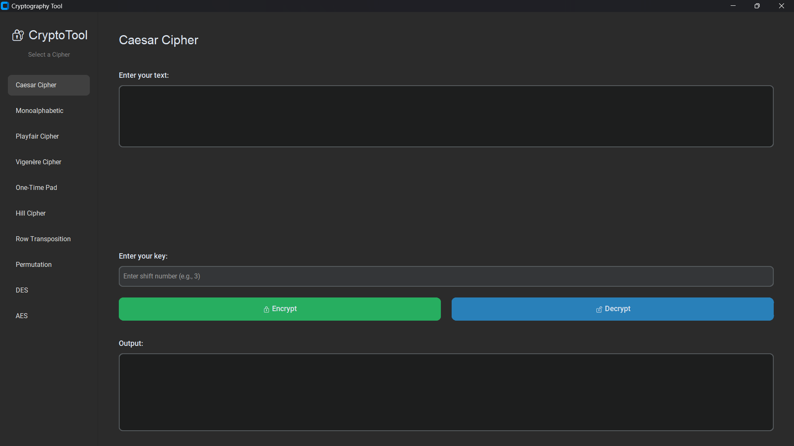

# 🔐 CryptoTool: Advanced Encryption Algorithms Suite

[](https://www.python.org/) []() []() [](https://www.linkedin.com/in/seif-elmuselmani/)

**CryptoTool** is a comprehensive cryptographic simulation software developed to bridge the gap between classical ciphers and modern encryption standards. It provides a clean, user-friendly interface to visualize how data is transformed securely.

> **Project Context:** Developed as a personal project to demonstrate mastery of algorithmic logic, data security concepts (DES/AES), and software architecture.

---

## 🚀 Key Features

This tool offers a robust implementation of various cryptographic techniques:

### 🏛️ Classical Ciphers (The Foundation)
* **Substitution:** Caesar, Monoalphabetic, Vigenère.
* **Polygraphic:** **Playfair Cipher** (Implementation of 5x5 Matrix & Digraph rules).
* **Transposition:** Row Transposition, Rail Fence.
* **Matrix-Based:** Hill Cipher (Linear Algebra operations).
* **Unbreakable:** One-Time Pad (OTP).

### 🛡️ Modern Standards (The Powerhouse)
* **DES (Data Encryption Standard):** Full 16-round Feistel network implementation.
* **AES (Advanced Encryption Standard):** The global standard for secure communication.
* **Security Modes:** Supports **CBC (Cipher Block Chaining)** mode for enhanced security to prevent pattern leakage.

---

## 📸 Screenshots

### Main Application Interface


---

## 🛠️ Tech Stack

* **Core Language:** Python 3.x
* **User Interface:** Tkinter (Custom Styled)
* **Cryptography:** `PyCryptodome` (For standard block cipher implementations)
* **Mathematics:** `NumPy` (For Matrix manipulations in Hill Cipher)

---

## ⚙️ Installation & Usage

1.  **Clone the Repository:**
    ```bash
    git clone [https://github.com/seif-elmuselmani/CryptoTool.git](https://github.com/seif-elmuselmani/CryptoTool.git)
    cd CryptoTool
    ```

2.  **Install Dependencies:**
    ```bash
    pip install -r requirements.txt
    ```

3.  **Run the App:**
    ```bash
    python main.py
    ```

---

## 👥 Authors

<div align="center">

| **Seif El-Din Mohamed** | **Mohamed Essam** |
| :---: | :---: |
| *Software Engineer & Architect* | *Software Engineer & Contributor* |
| [](https://www.linkedin.com/in/seif-elmuselmani/) | *Collaborator* |

</div>

